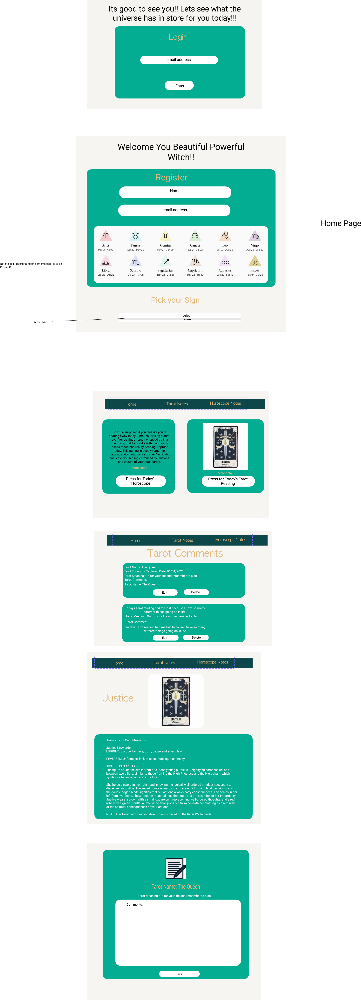
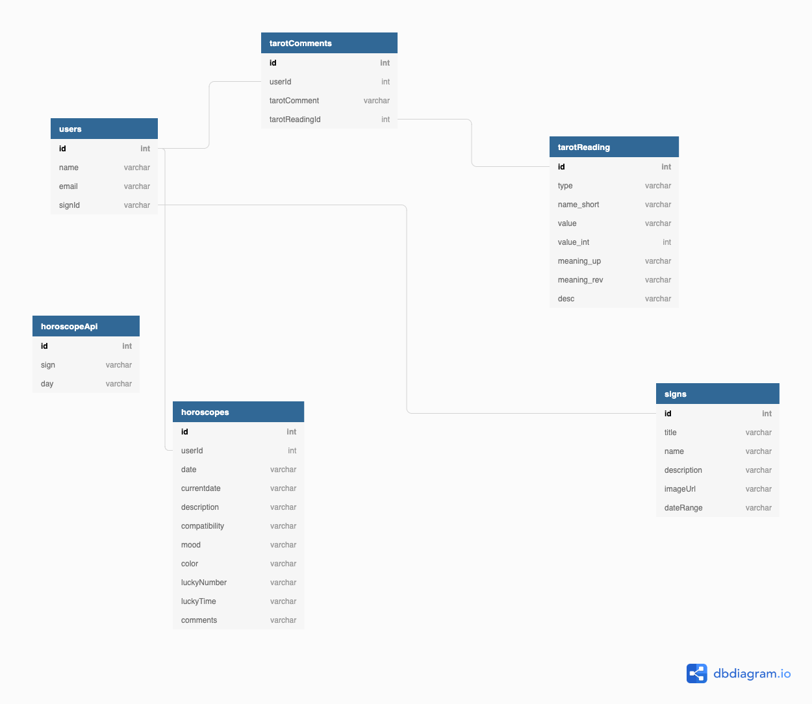

# The Magical Witch Horoscpe & Tarot Card 

The Magical Witch is a Javascript Applicaiton for dealing with navigating the world of witch craft.

## Installation

Use the package manager [github repo](https://github.com/Younique98/the-magical-witch) to view the site.

```bash
clone git@github.com:Younique98/the-magical-witch.git
```

## Usage

```javascript

```

## Contributing
Pull requests are welcome. For major changes, please open an issue first to discuss what you would like to change.

Please make sure to update tests as appropriate.

## License
[Erica Thompson](https://www.linkedin.com/in/ericathompsonsmiles/)